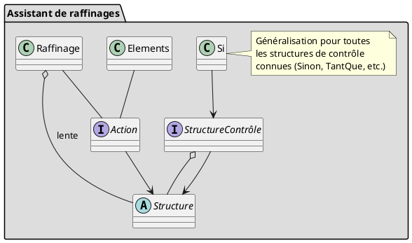
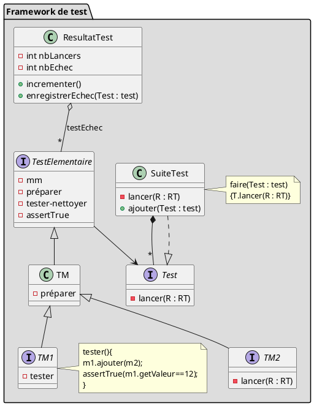

# UML

```plantuml
@startuml
package "Assistant de raffinages" #DDDDDD {

    abstract Structure {

    }

    interface Action {

    }

    interface StructureContrôle {

    }

    class Elements {

    }

    class Raffinage {

    }

    class Si {

    }

    note right of Si
        Généralisation pour toutes 
        les structures de contrôle 
        connues (Sinon, TantQue, etc.)
    end note


    Raffinage o-- Structure : lente
    StructureContrôle o-- Structure
    Si--> StructureContrôle
    Action-->Structure
    StructureContrôle-->Structure
    Elements--Action
    Raffinage --Action


}
@enduml
```

```plantuml
@startuml
package "Framework de test" #DDDDDD {

    interface TestElementaire {
        - mm
        - préparer
        - tester-nettoyer
        - assertTrue
    }

    interface Test {
        - lancer(R : RT)
    }

    class SuiteTest {
        - lancer(R : RT)
        + ajouter(Test : test)
    }

    class ResultatTest {
        - int nbLancers
        - int nbEchec
        + incrementer()
        + enregistrerEchec(Test : test)
    }

    note right of SuiteTest
        faire(Test : test)
        {T.lancer(R : RT)}
    end note

    SuiteTest *--"*" Test
    TestElementaire --> Test
    SuiteTest ..|> Test
    ResultatTest o--"*" TestElementaire : testEchec

    interface TM1 {
        - tester
    }
    
    note right of TM1
        tester(){
        m1.ajouter(m2);
        assertTrue(m1.getValeur==12);
        }
    end note

    interface TM2 {
        - lancer(R : RT)
    }

    class TM {
        - préparer
    }

    TM <|-- TM1
    TM <|-- TM2
    TestElementaire <|-- TM
}
@enduml
```