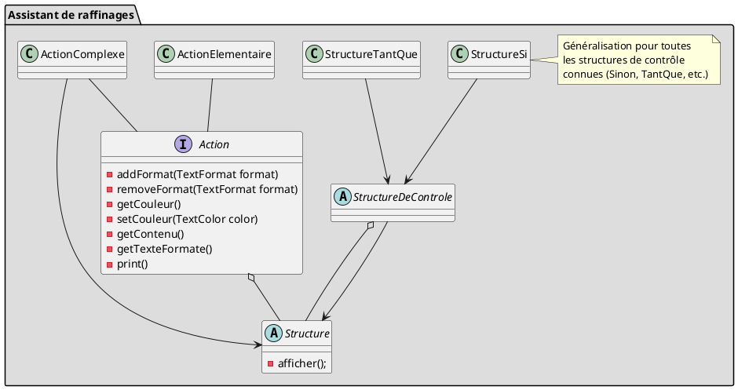

# UML

```plantuml
@startuml
package "Assistant de raffinages" #DDDDDD {

    abstract Structure {
        - afficher();
    }

    interface Action {
        - addFormat(TextFormat format)
        - removeFormat(TextFormat format)
        - getCouleur()
        - setCouleur(TextColor color)
        - getContenu()
        - getTexteFormate()
        - print()
    }

    abstract StructureDeControle {

    }

    class ActionElementaire {
    }

    class ActionComplexe {

    }

    class StructureSi {

    }

    class StructureTantQue {

    }

    note right of StructureSi
        Généralisation pour toutes 
        les structures de contrôle 
        connues (Sinon, TantQue, etc.)
    end note


    Action o-- Structure
    StructureDeControle o-- Structure
    StructureTantQue-->StructureDeControle
    StructureSi--> StructureDeControle
    ActionComplexe-->Structure
    StructureDeControle-->Structure
    ActionElementaire--Action
    ActionComplexe --Action


}
@enduml
```